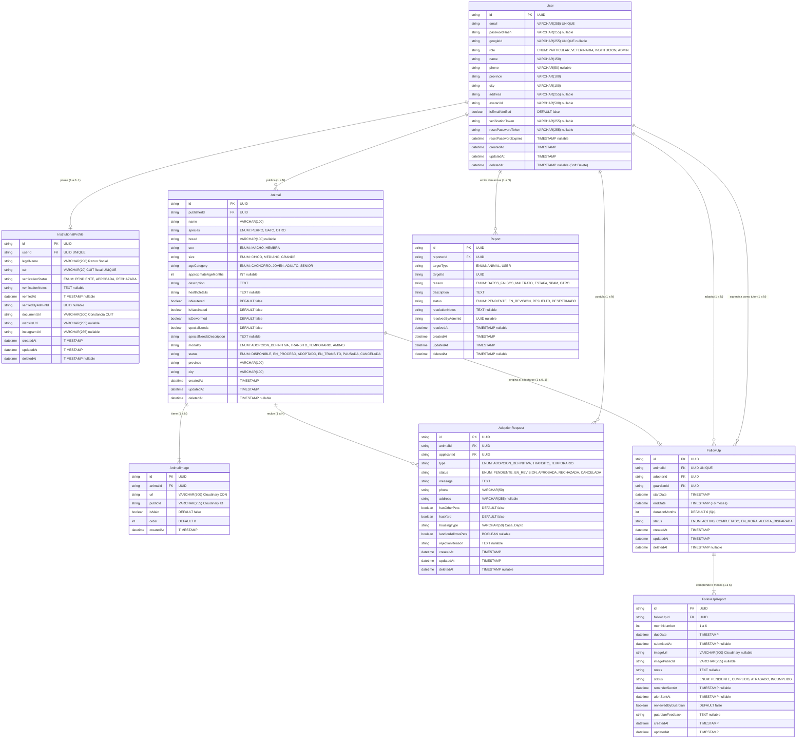

# Diagrama Entidad-Relación (ERD) — Cumpa 🐾

Este archivo contiene el diagrama interactivo de la base de datos de **Cumpa** modelado en formato **Mermaid**.  
Es renderizado visualmente por GitHub, VS Code y visores de Markdown.

