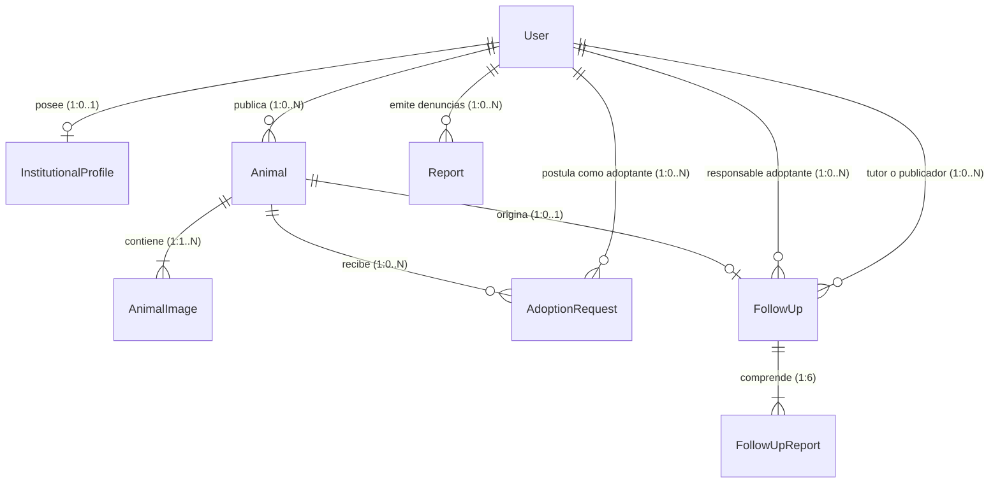

# Cumpa 🐾 — Documentación de Diseño de Base de Datos y Módulos del Backend

> **Trabajo Final Integrador (TFI)** — Tecnicatura Universitaria en Programación a Distancia (TUPaD)  
> **Universidad Tecnológica Nacional (UTN)**  
> **Grupo Nº:** 195  
> **Alumnos:** Mateo Serafini, Gonzalo Vega  
> **Tutor Académico:** Juan Ignacio Schiavonni  
> **Etapa:** 2.ª Entrega — Diseño y Módulos del Sistema (Condición de Regular)  
> **Stack Técnico Backend:** Node.js | Express | TypeScript | PostgreSQL (Neon) | Prisma ORM  
> **Repositorio del Proyecto:** [github.com/Mateoserafini/cumpa](https://github.com/Mateoserafini/cumpa)  
> **Fecha:** 25 de Septiembre de 2026  

---

## 📑 Tabla de Contenidos
1. [Introducción y Alcance de la Entrega](#1-introducción-y-alcance-de-la-entrega)
2. [Diseño de la Base de Datos Relacional (PostgreSQL + Prisma)](#2-diseño-de-la-base-de-datos-relacional-postgresql--prisma)
   - [2.1 Justificación Tecnológica y Motor de Base de Datos](#21-justificación-tecnológica-y-motor-de-base-de-datos)
   - [2.2 Diagrama Entidad-Relación (ERD) y Ubicación del Modelo Visual](#22-diagrama-entidad-relación-erd-y-ubicación-del-modelo-visual)
   - [2.3 Diccionario de Datos Exhaustivo](#23-diccionario-de-datos-exhaustivo)
     - [Tabla 1: users (Modelo: User)](#tabla-1-users-modelo-user)
     - [Tabla 2: institutional_profiles (Modelo: InstitutionalProfile)](#tabla-2-institutional_profiles-modelo-institutionalprofile)
     - [Tabla 3: animals (Modelo: Animal)](#tabla-3-animals-modelo-animal)
     - [Tabla 4: animal_images (Modelo: AnimalImage)](#tabla-4-animal_images-modelo-animalimage)
     - [Tabla 5: adoption_requests (Modelo: AdoptionRequest)](#tabla-5-adoption_requests-modelo-adoptionrequest)
     - [Tabla 6: follow_ups (Modelo: FollowUp)](#tabla-6-follow_ups-modelo-followup)
     - [Tabla 7: follow_up_reports (Modelo: FollowUpReport)](#tabla-7-follow_up_reports-modelo-followupreport)
     - [Tabla 8: reports (Modelo: Report)](#tabla-8-reports-modelo-report)
   - [2.4 Enumerados del Sistema (Enums)](#24-enumerados-del-sistema-enums)
   - [2.5 Políticas de Integridad, Índices y Soft Delete](#25-políticas-de-integridad-índices-y-soft-delete)
3. [Listado y Especificación de Módulos de Backend a Desarrollar](#3-listado-y-especificación-de-módulos-de-backend-a-desarrollar)
   - [3.1 Estructura Arquitectónica del Backend (`/server/src`)](#31-estructura-arquitectónica-del-backend-serversrc)
     - [Árbol de Directorios Completo](#árbol-de-directorios-completo)
     - [Responsabilidad por Directorio y Convenciones](#responsabilidad-por-directorio-y-convenciones)
   - [3.2 Módulo 1: Autenticación y Autorización (`modules/auth`)](#32-módulo-1-autenticación-y-autorización-modulesauth)
   - [3.3 Módulo 2: Gestión de Perfiles y Verificación Institucional (`modules/users`)](#33-módulo-2-gestión-de-perfiles-y-verificación-institucional-modulesusers)
   - [3.4 Módulo 3: Publicaciones y Gestión de Animales (`modules/animals`)](#34-módulo-3-publicaciones-y-gestión-de-animales-modulesanimals)
   - [3.5 Módulo 4: Contacto y Postulaciones de Adopción/Tránsito (`modules/contacts`)](#35-módulo-4-contacto-y-postulaciones-de-adopción-tránsito-modulescontacts)
   - [3.6 Módulo 5: Seguimiento Post-Adopción (`modules/followups`)](#36-módulo-5-seguimiento-post-adopción-modulesfollowups)
   - [3.7 Módulo 6: Tareas Programadas y Automatizaciones en Segundo Plano (`modules/jobs`)](#37-módulo-6-tareas-programadas-y-automatizaciones-en-segundo-plano-modulesjobs)
   - [3.8 Módulo 7: Panel de Administración y Moderación (`modules/admin`)](#38-módulo-7-panel-de-administración-y-moderación-modulesadmin)
   - [3.9 Módulo 8: Notificaciones y Comunicaciones Transaccionales (`modules/notifications`)](#39-módulo-8-notificaciones-y-comunicaciones-transaccionales-modulesnotifications)
4. [Conclusiones y Próximos Pasos](#4-conclusiones-y-próximos-pasos)
5. [Guía de Scaffolding y Comandos de Inicialización del Backend](#5-guía-de-scaffolding-y-comandos-de-inicialización-del-backend)

---

## 1. Introducción y Alcance de la Entrega

El presente documento constituye el informe técnico correspondiente a la **Segunda Entrega ("Diseño y Módulos")** requerida para la obtención de la **Condición de Regular** en la materia Trabajo Final Integrador de la Tecnicatura Universitaria en Programación a Distancia (**UTN**).

**"Cumpa"** es una plataforma web colaborativa orientada a centralizar, transparentar y dar seguimiento real a los procesos de adopción y acogimiento temporal (tránsito) de animales en la República Argentina, mitigando la actual dispersión e informalidad presente en redes sociales.

En concordancia con el alcance del **Producto Mínimo Viable (MVP)** aprobado en la 1.ª Entrega y los acuerdos de división de trabajo del equipo (en donde la contraparte de Frontend es abordada en documento complementario por el integrante Mateo Serafini), este informe expone en detalle:

1. **El diseño íntegro de persistencia relacional** implementado en **PostgreSQL** a través del ORM **Prisma**, garantizando consistencia, integridad referencial y trazabilidad mediante *soft-delete*.
2. **La especificación exhaustiva de los 8 módulos** que conforman la API REST del Backend, detallando sus responsabilidades, lógica de negocio, endpoints y mecanismos de integración externa (**Google OAuth 2.0**, **Cloudinary**, **Resend** y **node-cron**).

---

## 2. Diseño de la Base de Datos Relacional (PostgreSQL + Prisma)

### 2.1 Justificación Tecnológica y Motor de Base de Datos

Para el modelo de persistencia de **Cumpa** se ha seleccionado un motor Relacional (SQL): **PostgreSQL**, alojado en la infraestructura gestionada de **Neon** (PostgreSQL Serverless).

#### Razones principales de la elección:
- **Integridad Referencial Estricta:** El dominio del problema exige vínculos invariables y consistentes entre usuarios, animales publicados, solicitudes de adopción y el proceso mensual de seguimiento durante 6 meses. Un esquema relacional previene estados huérfanos o inconsistencias en los procesos.
- **Cumplimiento ACID:** Las transiciones de estado críticas (p. ej., aprobar una solicitud de postulación, marcar un animal como `ADOPTADO` y generar automáticamente los 6 reportes mensuales de seguimiento) demandan soporte transaccional robusto y atómico.
- **Prisma ORM como Herramienta de Modelado y Capa de Acceso:**
  - El diseño y la estructura de la base de datos se modelan de forma declarativa directamente en el archivo de esquema de Prisma (`schema.prisma`) utilizando el lenguaje PSL (*Prisma Schema Language*), en lugar de escribir manualmente sentencias SQL DDL (`CREATE TABLE`, `ALTER TABLE`, etc.).
  - El motor de migraciones de Prisma (`prisma migrate`) se encarga de traducir dicho modelo a sentencias SQL puras versionadas y ejecutarlas sobre el motor PostgreSQL en Neon, asegurando sincronización exacta entre código y base de datos.
  - Provee tipado estático end-to-end con TypeScript, reduciendo drásticamente los errores en tiempo de ejecución.
  - Protege nativamente contra ataques de Inyección SQL y desacopla la persistencia de la lógica de negocio.
- **Respaldo y Continuidad Operativa:** Neon implementa copias de seguridad automatizadas diarias y recuperación *Point-in-Time*, garantizando la preservación y alta disponibilidad de los datos.

---

### 2.2 Diagrama Entidad-Relación (ERD) y Ubicación del Modelo Visual

Para el diseño de la persistencia de datos se utiliza un **Diagrama Entidad-Relación (ERD)**, estándar de la ingeniería de software para modelar entidades, atributos, claves primarias (PK), foráneas (FK) y cardinalidades. *(Los diagramas de diseño orientado a objetos en UML, como diagramas de clases y de secuencia, se confeccionarán en la etapa posterior de implementación de los módulos).*

> [!NOTE]
> **Ubicación del Diagrama Interactivo (Mermaid ERD):**  
> El diagrama visual interactivo, renderizable directamente en GitHub y visores de Markdown mediante la sintaxis Mermaid, se encuentra versionado en el repositorio oficial en el archivo:  
> 🔗 [`server/prisma/ERD.md`](https://github.com/Mateoserafini/cumpa)

#### Diagrama de Relaciones del Modelo



#### Esquema Estructural y Cardinalidades Lógicas

```text
[User] 1 ──────── 0..1 [InstitutionalProfile]
  │
  ├── 1 ──────── 0..N [Animal]
  │                     │
  │                     ├── 1 ─────── 1..N [AnimalImage]
  │                     │
  │                     ├── 1 ─────── 0..N [AdoptionRequest]
  │                     │
  │                     └── 1 ─────── 0..1 [FollowUp]
  │                                           │
  │                                           └── 1 ─────── 6 [FollowUpReport]
  │
  ├── 1 ──────── 0..N [AdoptionRequest] (como postulante)
  ├── 1 ──────── 0..N [FollowUp] (como adoptante)
  ├── 1 ──────── 0..N [FollowUp] (como tutor/publicador original)
  └── 1 ──────── 0..N [Report] (denuncias emitidas por usuarios)
```

#### Descripción Detallada de Cardinalidades:
- **Un Usuario (`User`)** puede poseer a lo sumo 1 Perfil Institucional (**1 a 0..1**), en caso de ser refugio, fundación o veterinaria.
- **Un Usuario (`User`)** puede publicar de 0 a N Animales (**1 a 0..N**).
- **Cada Animal (`Animal`)** posee de 1 a N Imágenes (`AnimalImage`) alojadas en Cloudinary (**1 a 1..N**).
- **Un Animal (`Animal`)** puede recibir de 0 a N Solicitudes de Adopción (`AdoptionRequest`) (**1 a 0..N**).
- **Un Animal (`Animal`)** que pasa a estado `ADOPTADO` genera exactamente 1 Seguimiento (`FollowUp`) (**1 a 0..1**).
- **Cada Seguimiento (`FollowUp`)** comprende exactamente 6 Reportes Mensuales (`FollowUpReport`) (**1 a 6**), correspondientes a los meses 1, 2, 3, 4, 5 y 6 del compromiso asumido.
- **Un Usuario (`User`)** puede presentar 0 a N Solicitudes de Adopción a distintos animales (**1 a 0..N**).
- **Un Usuario (`User`)** puede actuar como Adoptante en 0 a N Seguimientos, y como Tutor (*Guardian*) en 0 a N Seguimientos.
- **Un Usuario (`User`)** puede generar 0 a N Denuncias (`Report`) sobre publicaciones o perfiles sospechosos.

---

### 2.3 Diccionario de Datos Exhaustivo

#### Tabla 1: `users` (Modelo: `User`)
*Propósito:* Registra a todas las personas y entidades que interactúan con el sistema.

| Campo | Tipo SQL | Nulo | Clave / Referencia | Descripción |
| :--- | :--- | :---: | :--- | :--- |
| `id` | `UUID` | NO | **PK** | Identificador único del usuario |
| `email` | `VARCHAR(255)` | NO | **UNIQUE** | Correo electrónico único |
| `passwordHash` | `VARCHAR(255)` | SI | — | Hash bcrypt (nulo si ingresa con Google) |
| `googleId` | `VARCHAR(255)` | SI | **UNIQUE** | Identificador de Google OAuth 2.0 |
| `role` | `ENUM (Role)` | NO | — | `PARTICULAR`, `VETERINARIA`, `INSTITUCION`, `ADMIN` |
| `name` | `VARCHAR(150)` | NO | — | Nombre completo o nombre de fantasía |
| `phone` | `VARCHAR(50)` | SI | — | Teléfono de contacto / WhatsApp |
| `province` | `VARCHAR(100)` | NO | — | Provincia de residencia |
| `city` | `VARCHAR(100)` | NO | — | Ciudad o localidad |
| `address` | `VARCHAR(255)` | SI | — | Dirección física opcional |
| `avatarUrl` | `VARCHAR(500)` | SI | — | URL de foto de perfil |
| `isEmailVerified` | `BOOLEAN` | NO | `DEFAULT false` | Indica si validó su correo |
| `verificationToken` | `VARCHAR(255)` | SI | — | Token de verificación de cuenta |
| `resetPasswordToken`| `VARCHAR(255)` | SI | — | Token para restablecer contraseña |
| `resetPasswordExpires` | `TIMESTAMP` | SI | — | Vencimiento del token de contraseña |
| `createdAt` | `TIMESTAMP` | NO | `DEFAULT now()` | Fecha y hora de creación |
| `updatedAt` | `TIMESTAMP` | NO | `AUTO_UPDATE` | Fecha y hora de última modificación |
| `deletedAt` | `TIMESTAMP` | SI | — | Soft delete (fecha de baja lógica) |

**Índices:**
- `@@index([role])` → Optimiza consultas de filtrado por tipo de actor.
- `@@index([province, city])` → Optimiza búsquedas geolocalizadas.

---

#### Tabla 2: `institutional_profiles` (Modelo: `InstitutionalProfile`)
*Propósito:* Almacena la personería legal y fiscal de refugios, ONGs y veterinarias.

| Campo | Tipo SQL | Nulo | Clave / Referencia | Descripción |
| :--- | :--- | :---: | :--- | :--- |
| `id` | `UUID` | NO | **PK** | Identificador único del perfil legal |
| `userId` | `UUID` | NO | **FK -> users.id** | Vínculo 1 a 1 con el usuario (`onDelete: Cascade`) |
| `legalName` | `VARCHAR(200)` | NO | — | Razón social o denominación legal |
| `cuit` | `VARCHAR(20)` | NO | **UNIQUE** | CUIT fiscal de la entidad |
| `verificationStatus` | `ENUM (VerificationStatus)` | NO | `DEFAULT PENDIENTE` | `PENDIENTE`, `APROBADA`, `RECHAZADA` |
| `verificationNotes` | `TEXT` | SI | — | Observaciones del Administrador |
| `verifiedAt` | `TIMESTAMP` | SI | — | Fecha en la que fue validado |
| `verifiedByAdminId` | `UUID` | SI | — | ID del administrador interviniente |
| `documentUrl` | `VARCHAR(500)` | SI | — | URL de constancia de CUIT/estatuto en Cloudinary |
| `websiteUrl` | `VARCHAR(255)` | SI | — | Sitio web oficial |
| `instagramUrl` | `VARCHAR(255)` | SI | — | Red social institucional |
| `createdAt` | `TIMESTAMP` | NO | `DEFAULT now()` | Fecha de alta del trámite |
| `updatedAt` | `TIMESTAMP` | NO | `AUTO_UPDATE` | Fecha de modificación |
| `deletedAt` | `TIMESTAMP` | SI | — | Soft delete |

**Índices:**
- `@@index([verificationStatus])` → Facilita la cola de pendientes del panel de administración.

---

#### Tabla 3: `animals` (Modelo: `Animal`)
*Propósito:* Registra las publicaciones de animales disponibles para adopción o tránsito.

| Campo | Tipo SQL | Nulo | Clave / Referencia | Descripción |
| :--- | :--- | :---: | :--- | :--- |
| `id` | `UUID` | NO | **PK** | Identificador único del animal |
| `publisherId` | `UUID` | NO | **FK -> users.id** | Usuario que publica el animal |
| `name` | `VARCHAR(100)` | NO | — | Nombre del animal |
| `species` | `ENUM (Species)` | NO | — | `PERRO`, `GATO`, `OTRO` |
| `breed` | `VARCHAR(100)` | SI | — | Raza específica o Mestizo |
| `sex` | `ENUM (Sex)` | NO | — | `MACHO`, `HEMBRA` |
| `size` | `ENUM (Size)` | NO | — | `CHICO`, `MEDIANO`, `GRANDE` |
| `ageCategory` | `ENUM (AgeCategory)` | NO | — | `CACHORRO`, `JOVEN`, `ADULTO`, `SENIOR` |
| `approximateAgeMonths` | `INT` | SI | — | Edad estimada expresada en meses |
| `description` | `TEXT` | NO | — | Historia, temperamento y características |
| `healthDetails` | `TEXT` | SI | — | Detalles veterinarios adicionales |
| `isNeutered` | `BOOLEAN` | NO | `DEFAULT false` | Indica si está castrado/esterilizado |
| `isVaccinated` | `BOOLEAN` | NO | `DEFAULT false` | Indica si posee plan de vacunación al día |
| `isDewormed` | `BOOLEAN` | NO | `DEFAULT false` | Indica si está desparasitado |
| `specialNeeds` | `BOOLEAN` | NO | `DEFAULT false` | Indica si tiene cuidados especiales |
| `specialNeedsDescription` | `TEXT` | SI | — | Descripción de la condición especial |
| `modality` | `ENUM (Modality)` | NO | `DEFAULT ADOPCION_DEFINITIVA` | `ADOPCION_DEFINITIVA`, `TRANSITO_TEMPORARIO`, `AMBAS` |
| `status` | `ENUM (AnimalStatus)` | NO | `DEFAULT DISPONIBLE` | `DISPONIBLE`, `EN_PROCESO`, `ADOPTADO`, `EN_TRANSITO`, `PAUSADA`, `CANCELADA` |
| `province` | `VARCHAR(100)` | NO | — | Provincia donde se encuentra |
| `city` | `VARCHAR(100)` | NO | — | Localidad donde se encuentra |
| `createdAt` | `TIMESTAMP` | NO | `DEFAULT now()` | Fecha de publicación |
| `updatedAt` | `TIMESTAMP` | NO | `AUTO_UPDATE` | Fecha de última actualización |
| `deletedAt` | `TIMESTAMP` | SI | — | Soft delete |

**Índices:**
- `@@index([publisherId])` → Búsqueda rápida de "Mis Publicaciones".
- `@@index([species, status])` → Filtro principal del catálogo público.
- `@@index([province, city])` → Filtrado regional.
- `@@index([modality])` → Filtrado por Adopción o Tránsito.

---

#### Tabla 4: `animal_images` (Modelo: `AnimalImage`)
*Propósito:* Almacena las referencias a las fotos del animal alojadas en Cloudinary.

| Campo | Tipo SQL | Nulo | Clave / Referencia | Descripción |
| :--- | :--- | :---: | :--- | :--- |
| `id` | `UUID` | NO | **PK** | Identificador único de la imagen |
| `animalId` | `UUID` | NO | **FK -> animals.id** | Vínculo al animal (`onDelete: Cascade`) |
| `url` | `VARCHAR(500)` | NO | — | URL pública de entrega en CDN |
| `publicId` | `VARCHAR(255)` | NO | — | ID en Cloudinary para gestión y borrado |
| `isMain` | `BOOLEAN` | NO | `DEFAULT false` | Indica si es la portada principal |
| `order` | `INT` | NO | `DEFAULT 0` | Orden de visualización en carrusel |
| `createdAt` | `TIMESTAMP` | NO | `DEFAULT now()` | Fecha de carga |

**Índices:**
- `@@index([animalId])` → Acceso indexado a la galería multimedia del animal.

---

#### Tabla 5: `adoption_requests` (Modelo: `AdoptionRequest`)
*Propósito:* Almacena las postulaciones y solicitudes de contacto enviadas por interesados. Evita la pérdida de datos frente a filtros de spam de casillas de correo.

| Campo | Tipo SQL | Nulo | Clave / Referencia | Descripción |
| :--- | :--- | :---: | :--- | :--- |
| `id` | `UUID` | NO | **PK** | Identificador único de la solicitud |
| `animalId` | `UUID` | NO | **FK -> animals.id** | Animal al cual se postula |
| `applicantId` | `UUID` | NO | **FK -> users.id** | Usuario postulante interesado |
| `type` | `ENUM (Modality)` | NO | `DEFAULT ADOPCION_DEFINITIVA` | `ADOPCION_DEFINITIVA` o `TRANSITO_TEMPORARIO` |
| `status` | `ENUM (RequestStatus)` | NO | `DEFAULT PENDIENTE` | `PENDIENTE`, `EN_REVISION`, `APROBADA`, `RECHAZADA`, `CANCELADA` |
| `message` | `TEXT` | NO | — | Carta de motivación / presentación |
| `phone` | `VARCHAR(50)` | NO | — | Teléfono directo informado |
| `address` | `VARCHAR(255)` | SI | — | Zona / domicilio del adoptante |
| `hasOtherPets` | `BOOLEAN` | NO | `DEFAULT false` | Declara si convive con otros animales |
| `hasYard` | `BOOLEAN` | NO | `DEFAULT false` | Declara si tiene patio/jardín cerrado |
| `housingType` | `VARCHAR(50)` | SI | — | Casa, Departamento, PH |
| `landlordAllowsPets` | `BOOLEAN` | SI | — | Autorización del propietario si alquila |
| `rejectionReason` | `TEXT` | SI | — | Motivo de rechazo en caso aplicable |
| `createdAt` | `TIMESTAMP` | NO | `DEFAULT now()` | Fecha de envío de postulación |
| `updatedAt` | `TIMESTAMP` | NO | `AUTO_UPDATE` | Fecha de actualización |
| `deletedAt` | `TIMESTAMP` | SI | — | Soft delete |

**Índices:**
- `@@index([animalId])` → Solicitudes asociadas a una publicación específica.
- `@@index([applicantId])` → Historial de postulaciones del usuario.
- `@@index([status])` → Filtrado de solicitudes según estado de tramitación.

---

#### Tabla 6: `follow_ups` (Modelo: `FollowUp`)
*Propósito:* Núcleo de trazabilidad post-adopción. Se crea automáticamente cuando una solicitud es aprobada y el animal pasa a estado `ADOPTADO`. Tiene una duración estricta de 6 meses en todos los casos.

| Campo | Tipo SQL | Nulo | Clave / Referencia | Descripción |
| :--- | :--- | :---: | :--- | :--- |
| `id` | `UUID` | NO | **PK** | Identificador del seguimiento |
| `animalId` | `UUID` | NO | **UNIQUE FK -> animals.id** | Vínculo unívoco con el animal adoptado |
| `adopterId` | `UUID` | NO | **FK -> users.id** | Usuario adoptante responsable |
| `guardianId` | `UUID` | NO | **FK -> users.id** | Usuario o institución que dio en adopción |
| `startDate` | `TIMESTAMP` | NO | `DEFAULT now()` | Fecha de inicio del seguimiento |
| `endDate` | `TIMESTAMP` | NO | — | Fecha de finalización (`startDate` + 6 meses) |
| `durationMonths` | `INT` | NO | `DEFAULT 6` | Duración invariable fijada en 6 meses |
| `status` | `ENUM (FollowUpStatus)` | NO | `DEFAULT ACTIVO` | `ACTIVO`, `COMPLETADO`, `EN_MORA`, `ALERTA_DISPARADA` |
| `createdAt` | `TIMESTAMP` | NO | `DEFAULT now()` | Fecha de apertura del proceso |
| `updatedAt` | `TIMESTAMP` | NO | `AUTO_UPDATE` | Fecha de modificación |
| `deletedAt` | `TIMESTAMP` | SI | — | Soft delete |

**Índices:**
- `@@index([adopterId])` → Seguimientos que debe cumplir el adoptante.
- `@@index([guardianId])` → Seguimientos que debe supervisar el rescatista.
- `@@index([status])` → Monitoreo de seguimientos activos y en mora.

---

#### Tabla 7: `follow_up_reports` (Modelo: `FollowUpReport`)
*Propósito:* Cada una de las 6 instancias mensuales obligatorias de reporte fotográfico.

| Campo | Tipo SQL | Nulo | Clave / Referencia | Descripción |
| :--- | :--- | :---: | :--- | :--- |
| `id` | `UUID` | NO | **PK** | Identificador del reporte mensual |
| `followUpId` | `UUID` | NO | **FK -> follow_ups.id** | Vínculo al proceso madre (`onDelete: Cascade`) |
| `monthNumber` | `INT` | NO | — | Número de mes (del 1 al 6) |
| `dueDate` | `TIMESTAMP` | NO | — | Fecha límite estricta para la entrega |
| `submittedAt` | `TIMESTAMP` | SI | — | Fecha real en que el usuario subió la foto |
| `imageUrl` | `VARCHAR(500)` | SI | — | Foto de prueba en Cloudinary |
| `imagePublicId` | `VARCHAR(255)` | SI | — | Public ID en Cloudinary |
| `notes` | `TEXT` | SI | — | Comentarios sobre el estado del animal |
| `status` | `ENUM (ReportStatus)` | NO | `DEFAULT PENDIENTE` | `PENDIENTE`, `CUMPLIDO`, `ATRASADO`, `INCUMPLIDO` |
| `reminderSentAt` | `TIMESTAMP` | SI | — | Fecha de notificación preventiva por email |
| `alertSentAt` | `TIMESTAMP` | SI | — | Fecha en que se disparó la alerta por mora |
| `reviewedByGuardian` | `BOOLEAN` | NO | `DEFAULT false` | Indica si el publicador dio el visto bueno |
| `guardianFeedback` | `TEXT` | SI | — | Devolución o mensaje del publicador |
| `createdAt` | `TIMESTAMP` | NO | `DEFAULT now()` | Fecha de creación |
| `updatedAt` | `TIMESTAMP` | NO | `AUTO_UPDATE` | Fecha de modificación |

**Restricciones e Índices:**
- `@@unique([followUpId, monthNumber])` → Garantiza exactamente un reporte por mes (1 al 6).
- `@@index([dueDate, status])` → Índice crítico para el cron job de detección de mora y recordatorios.

---

#### Tabla 8: `reports` (Modelo: `Report`)
*Propósito:* Gestión reactiva de denuncias sobre publicaciones o usuarios indebidos.

| Campo | Tipo SQL | Nulo | Clave / Referencia | Descripción |
| :--- | :--- | :---: | :--- | :--- |
| `id` | `UUID` | NO | **PK** | Identificador de la denuncia |
| `reporterId` | `UUID` | NO | **FK -> users.id** | Usuario que emite la denuncia |
| `targetType` | `ENUM (ReportTargetType)` | NO | — | `ANIMAL` o `USER` |
| `targetId` | `UUID` | NO | — | ID de la entidad denunciada |
| `reason` | `ENUM (ReportReason)` | NO | — | `DATOS_FALSOS`, `MALTRATO`, `ESTAFA`, `SPAM`, `OTRO` |
| `description` | `TEXT` | NO | — | Detalle fundamentado de la denuncia |
| `status` | `ENUM (ReportReviewStatus)` | NO | `DEFAULT PENDIENTE` | `PENDIENTE`, `EN_REVISION`, `RESUELTO`, `DESESTIMADO` |
| `resolutionNotes` | `TEXT` | SI | — | Dictamen y notas del administrador |
| `resolvedByAdminId` | `UUID` | SI | — | ID del administrador que resolvió |
| `resolvedAt` | `TIMESTAMP` | SI | — | Fecha de resolución del incidente |
| `createdAt` | `TIMESTAMP` | NO | `DEFAULT now()` | Fecha de radicación de la denuncia |
| `updatedAt` | `TIMESTAMP` | NO | `AUTO_UPDATE` | Fecha de actualización |
| `deletedAt` | `TIMESTAMP` | SI | — | Soft delete |

**Índices:**
- `@@index([targetType, targetId])` → Conteo rápido de denuncias por objetivo.
- `@@index([status])` → Bandeja de moderación de administradores.

---

### 2.4 Enumerados del Sistema (Enums)

Los tipos enumerados definen los estados finitos y tipados de cada entidad en la base de datos PostgreSQL mediante Prisma:

```prisma
enum Role {
  PARTICULAR
  VETERINARIA
  INSTITUCION
  ADMIN
}

enum VerificationStatus {
  PENDIENTE
  APROBADA
  RECHAZADA
}

enum Species {
  PERRO
  GATO
  OTRO
}

enum Sex {
  MACHO
  HEMBRA
}

enum Size {
  CHICO
  MEDIANO
  GRANDE
}

enum AgeCategory {
  CACHORRO
  JOVEN
  ADULTO
  SENIOR
}

enum Modality {
  ADOPCION_DEFINITIVA
  TRANSITO_TEMPORARIO
  AMBAS
}

enum AnimalStatus {
  DISPONIBLE
  EN_PROCESO
  ADOPTADO
  EN_TRANSITO
  PAUSADA
  CANCELADA
}

enum RequestStatus {
  PENDIENTE
  EN_REVISION
  APROBADA
  RECHAZADA
  CANCELADA
}

enum FollowUpStatus {
  ACTIVO
  COMPLETADO
  EN_MORA
  ALERTA_DISPARADA
}

enum ReportStatus {
  PENDIENTE
  CUMPLIDO
  ATRASADO
  INCUMPLIDO
}

enum ReportTargetType {
  ANIMAL
  USER
}

enum ReportReason {
  DATOS_FALSOS
  MALTRATO
  ESTAFA
  SPAM
  OTRO
}

enum ReportReviewStatus {
  PENDIENTE
  EN_REVISION
  RESUELTO
  DESESTIMADO
}
```

---

### 2.5 Políticas de Integridad, Índices y Soft Delete

1. **Soft Delete Universal:**  
   Todas las tablas transaccionales implementan la columna `deletedAt (TIMESTAMP NULO)`. Al dar de baja un registro, no se ejecuta un `DELETE` físico en la base de datos, sino que se estampa la fecha de baja lógica. Esto preserva la trazabilidad jurídica, evita la rotura de vínculos en cascada involuntarios y permite auditoría posterior de todos los procesos de adopción.
2. **Integridad Transaccional de los 6 Meses de Seguimiento:**  
   La creación de un `FollowUp` se ejecuta dentro de una transacción atómica (`prisma.$transaction`) que calcula inmediatamente las 6 fechas de vencimiento obligatorias (`dueDate` a 30, 60, 90, 120, 150 y 180 días) e inserta simultáneamente los 6 registros de `FollowUpReport` correspondientes.
3. **Indexación Estratégica:**  
   Se incorporan índices compuestos para garantizar tiempos de respuesta inferiores a 50 ms en búsquedas con filtros combinados del catálogo público (especie, estado, provincia y ciudad) y en la ejecución de los cron jobs diarios.

---

## 3. Listado y Especificación de Módulos de Backend a Desarrollar

### 3.1 Estructura Arquitectónica del Backend (`/server/src`)

El backend está estructurado sobre **Node.js**, **Express** y **TypeScript** siguiendo una **arquitectura modular en capas por dominio**, ubicada en `server/src/modules/`. Cada módulo encapsula su responsabilidad funcional mediante:

- `*.routes.ts`: Definición de endpoints REST, middlewares de seguridad y validaciones.
- `*.controller.ts`: Recepción y sanitización del payload HTTP, delegación a la capa de servicio y estructuración de respuestas normalizadas.
- `*.service.ts`: Lógica pura de negocio, reglas de validación y llamadas al ORM Prisma.
- `*.validation.ts`: Esquemas de validación de entrada mediante `express-validator`.

#### Árbol de Directorios Completo

```text
server/
├── prisma/
│   ├── migrations/                  # Historial de migraciones SQL versionadas
│   ├── ERD.md                       # Diagrama Entidad-Relación en formato Mermaid
│   └── schema.prisma                # Definición del modelo de datos en Prisma PSL
├── src/
│   ├── config/                      # Configuración centralizada de entorno y servicios
│   │   ├── cloudinary.config.ts     # SDK de Cloudinary
│   │   ├── env.config.ts            # Validación de variables de entorno con dotenv
│   │   └── passport.config.ts       # Estrategia de Google OAuth 2.0
│   ├── jobs/                        # Tareas programadas en segundo plano (node-cron)
│   │   ├── followupBreachAlert.job.ts
│   │   ├── followupReminder.job.ts
│   │   └── tokenCleanup.job.ts
│   ├── middlewares/                 # Interceptores y filtros de peticiones HTTP
│   │   ├── auth.middleware.ts       # Validación y decodificación de tokens JWT
│   │   ├── errorHandler.middleware.ts # Captura global de excepciones y respuestas 500
│   │   ├── roleGuard.middleware.ts  # Control de acceso basado en roles (RBAC)
│   │   └── validateRequest.middleware.ts # Procesamiento de errores de express-validator
│   ├── modules/                     # MÓDULOS DE NEGOCIO PRINCIPALES (Domain-Driven)
│   │   ├── auth/                    # [Módulo 1] Autenticación y Autorización
│   │   │   ├── auth.controller.ts
│   │   │   ├── auth.routes.ts
│   │   │   ├── auth.service.ts
│   │   │   └── auth.validation.ts
│   │   ├── users/                   # [Módulo 2] Perfiles y Verificación Institucional
│   │   │   ├── users.controller.ts
│   │   │   ├── users.routes.ts
│   │   │   ├── users.service.ts
│   │   │   └── users.validation.ts
│   │   ├── animals/                 # [Módulo 3] Publicaciones y Gestión de Animales
│   │   │   ├── animals.controller.ts
│   │   │   ├── animals.routes.ts
│   │   │   ├── animals.service.ts
│   │   │   └── animals.validation.ts
│   │   ├── contacts/                # [Módulo 4] Contacto y Postulaciones de Adopción
│   │   │   ├── contacts.controller.ts
│   │   │   ├── contacts.routes.ts
│   │   │   ├── contacts.service.ts
│   │   │   └── contacts.validation.ts
│   │   ├── followups/               # [Módulo 5] Seguimiento Post-Adopción
│   │   │   ├── followups.controller.ts
│   │   │   ├── followups.routes.ts
│   │   │   ├── followups.service.ts
│   │   │   └── followups.validation.ts
│   │   ├── admin/                   # [Módulo 7] Administración y Moderación
│   │   │   ├── admin.controller.ts
│   │   │   ├── admin.routes.ts
│   │   │   ├── admin.service.ts
│   │   │   └── admin.validation.ts
│   │   └── notifications/           # [Módulo 8] Notificaciones Transaccionales (Resend)
│   │       ├── emailTemplates/      # Plantillas HTML responsivas de correos
│   │       └── resend.service.ts    # Cliente singleton de Resend
│   ├── types/                       # Extensiones de tipos globales y DTOs
│   │   ├── express.d.ts             # Extensión de Request con user autenticado
│   │   └── index.ts
│   ├── utils/                       # Utilidades puras reutilizables
│   │   ├── cuitValidator.ts         # Algoritmo de validación de CUIT argentino
│   │   └── logger.ts                # Logger estructurado de consola
│   ├── app.ts                       # Configuración de Express, middlewares y rutas
│   └── server.ts                    # Punto de entrada HTTP y arranque de cron jobs
├── .env.example                     # Plantilla de variables requeridas
├── package.json                     # Dependencias y scripts del backend
└── tsconfig.json                    # Configuración estricta de compilador TypeScript
```

#### Responsabilidad por Directorio y Convenciones

| Directorio | Responsabilidad Técnica y Alcance | Convención de Nomenclatura |
| :--- | :--- | :--- |
| `server/prisma/` | Esquema declarativo de base de datos (`schema.prisma`), migraciones versionadas y documentación ERD. | `snake_case` para migraciones, `PascalCase` para modelos PSL. |
| `server/src/config/` | Clientes de servicios externos y variables de entorno (`env`, `cloudinary`, `passport`). | `camelCase.config.ts` (ej. `cloudinary.config.ts`). |
| `server/src/jobs/` | Automatizaciones en segundo plano orquestadas por `node-cron`. | `camelCase.job.ts` (ej. `followupReminder.job.ts`). |
| `server/src/middlewares/` | Guardas de autenticación JWT, autorización RBAC y captura global de excepciones. | `camelCase.middleware.ts` (ej. `auth.middleware.ts`). |
| `server/src/modules/<modulo>/` | Núcleo de dominio de negocio. Encapsula rutas, controladores, servicios y validadores. | `kebab-case` para la carpeta del módulo. |
| `server/src/modules/<modulo>/*.routes.ts` | Definición de verbos HTTP, paths, middlewares y vinculación a controladores. | `modulo.routes.ts` (ej. `animals.routes.ts`). |
| `server/src/modules/<modulo>/*.controller.ts` | Extracción de parámetros (`req.body`, `req.params`), delegación y respuesta HTTP. | `modulo.controller.ts` (ej. `animals.controller.ts`). |
| `server/src/modules/<modulo>/*.service.ts` | Reglas de negocio puras, transacciones y consultas a Prisma Client. | `modulo.service.ts` (ej. `animals.service.ts`). |
| `server/src/modules/<modulo>/*.validation.ts` | Reglas de sanitización y validación con `express-validator`. | `modulo.validation.ts` (ej. `animals.validation.ts`). |
| `server/src/utils/` | Funciones utilitarias independientes de frameworks (algoritmo Módulo 11 de CUIT). | `camelCase.ts` (ej. `cuitValidator.ts`). |

---

### 3.2 Módulo 1: Autenticación y Autorización (`modules/auth`)

- **Nombre Funcional:** Módulo de Identidad, Autenticación y Control de Acceso.
- **Directorio:** `server/src/modules/auth/`
- **Entidades de Base de Datos:** `User`
- **Integraciones Externas:** Passport Google OAuth 2.0, Resend (envío de tokens de activación y recuperación).
- **Responsabilidad y Alcance:**  
  Gestionar el ciclo de vida de identidad y seguridad de los usuarios, abarcando registro tradicional, inicio de sesión mediante JWT, autenticación federada con Google, verificación de casillas de correo y recuperación de contraseñas.

#### Casos de Uso Principales:
1. Registro de usuario local con hash de contraseña mediante `bcryptjs` (salt 10).
2. Generación y despacho de token de activación de cuenta vía email transaccional con Resend.
3. Inicio de sesión local con emisión de JSON Web Token (JWT) firmado.
4. Autenticación e integración federada mediante Google OAuth 2.0 (`passport-google-oauth20`).
5. Solicitud y ejecución de reseteo seguro de clave con tokens criptográficos de expiración corta.
6. Middleware de control de acceso basado en roles (RBAC: `PARTICULAR`, `VETERINARIA`, `INSTITUCION`, `ADMIN`).

#### Endpoints REST Planificados

| Método | Endpoint | Acceso / Permiso | Descripción / Propósito |
| :--- | :--- | :--- | :--- |
| `POST` | `/api/auth/register` | Público | Registro de nuevo usuario (Particular o Institucional). |
| `POST` | `/api/auth/login` | Público | Autenticación con credenciales y emisión de JWT. |
| `GET` | `/api/auth/google` | Público | Redirección inicial hacia el consentimiento de Google Accounts. |
| `GET` | `/api/auth/google/callback` | Público | Callback OAuth de Google, creación/login y redirección con JWT. |
| `GET` | `/api/auth/verify-email/:token` | Público | Confirmación y activación de casilla de correo electrónico. |
| `POST` | `/api/auth/forgot-password` | Público | Solicitud de restablecimiento de contraseña vía email. |
| `POST` | `/api/auth/reset-password` | Público | Actualización de contraseña mediante token temporal válido. |

#### Contratos Técnicos de Entrada y Salida

- **Registro de Usuario (`POST /api/auth/register`):**
  - *Request Body:*
    ```typescript
    interface RegisterUserDto {
      email: string;
      password: string;
      name: string;
      role: 'PARTICULAR' | 'VETERINARIA' | 'INSTITUCION';
      province: string;
      city: string;
      phone?: string;
    }
    ```
  - *Response Body (201 Created):*
    ```typescript
    interface RegisterUserResponse {
      message: "Usuario registrado. Revise su email para verificar su cuenta.";
      userId: string;
    }
    ```
- **Login de Usuario (`POST /api/auth/login`):**
  - *Request Body:*
    ```typescript
    interface LoginDto {
      email: string;
      password: string;
    }
    ```
  - *Response Body (200 OK):*
    ```typescript
    interface LoginResponse {
      token: string;
      user: {
        id: string;
        email: string;
        name: string;
        role: 'PARTICULAR' | 'VETERINARIA' | 'INSTITUCION' | 'ADMIN';
        isEmailVerified: boolean;
      };
    }
    ```

---

### 3.3 Módulo 2: Gestión de Perfiles y Verificación Institucional (`modules/users`)

- **Nombre Funcional:** Gestión de Perfiles y Validación Legal de Instituciones.
- **Directorio:** `server/src/modules/users/`
- **Entidades de Base de Datos:** `User`, `InstitutionalProfile`
- **Integraciones Externas:** Cloudinary (almacenamiento de comprobante de CUIT / constancia legal en PDF o imagen).
- **Responsabilidad y Alcance:**  
  Administración de los datos de perfil de los usuarios y gestión del flujo formal de verificación para refugios, ONGs y veterinarias mediante la validación del CUIT y documentación respaldatoria.

#### Casos de Uso Principales:
1. Consulta y actualización de datos personales y de contacto del perfil autenticado.
2. Alta y postulación del Perfil Institucional para cuentas con rol `INSTITUCION` o `VETERINARIA`, adjuntando CUIT y comprobante digital.
3. Consulta del estado de verificación de la entidad (`PENDIENTE`, `APROBADA`, `RECHAZADA`).
4. Restricción operativa: las organizaciones con verificación `PENDIENTE` o `RECHAZADA` no pueden dar de alta publicaciones hasta que el administrador apruebe su documentación.

#### Endpoints REST Planificados

| Método | Endpoint | Acceso / Permiso | Descripción / Propósito |
| :--- | :--- | :--- | :--- |
| `GET` | `/api/users/profile` | Privado (Autenticado) | Obtención de los datos completos del perfil del usuario en sesión. |
| `PUT` | `/api/users/profile` | Privado (Autenticado) | Actualización de teléfono, dirección, localidad y avatar. |
| `POST` | `/api/users/institutional-verification` | Privado (`INSTITUCION`, `VETERINARIA`) | Carga de CUIT, datos fiscales y archivo probatorio. |
| `GET` | `/api/users/institutional-status` | Privado (`INSTITUCION`, `VETERINARIA`) | Consulta del dictamen de validación de personería legal. |

#### Contratos Técnicos de Entrada y Salida

- **Actualización de Perfil (`PUT /api/users/profile`):**
  - *Request Body:*
    ```typescript
    interface UpdateProfileDto {
      name?: string;
      phone?: string;
      province?: string;
      city?: string;
      address?: string;
      avatarUrl?: string;
    }
    ```
  - *Response Body (200 OK):*
    ```typescript
    interface UpdateProfileResponse {
      message: "Perfil actualizado correctamente";
      user: {
        id: string;
        name: string;
        phone: string | null;
        province: string;
        city: string;
        address: string | null;
        avatarUrl: string | null;
      };
    }
    ```
- **Postulación Institucional (`POST /api/users/institutional-verification`):**
  - *Multipart / Form-Data:* `legalName`, `cuit`, `websiteUrl?`, `instagramUrl?`, `documentFile` (PDF/JPG).
  - *Response Body (201 Created):*
    ```typescript
    interface InstitutionalVerificationResponse {
      message: "Solicitud de verificación enviada para revisión.";
      profileId: string;
      status: "PENDIENTE";
    }
    ```

---

### 3.4 Módulo 3: Publicaciones y Gestión de Animales (`modules/animals`)

- **Nombre Funcional:** Catálogo General, Publicaciones y Carga Multimedia.
- **Directorio:** `server/src/modules/animals/`
- **Entidades de Base de Datos:** `Animal`, `AnimalImage`, `User`
- **Integraciones Externas:** Cloudinary (carga de fotografías, generación de miniaturas y entrega en formato WebP vía CDN).
- **Responsabilidad y Alcance:**  
  Gestión integral del catálogo de animales disponibles para adopción o acogimiento transitorio, búsqueda facetada avanzada y subida optimizada de fotografías.

#### Casos de Uso Principales:
1. Búsqueda pública de animales con filtros combinados: especie (`PERRO`, `GATO`, `OTRO`), tamaño, sexo, categoría de edad, provincia, ciudad y modalidad (`ADOPCION_DEFINITIVA`, `TRANSITO_TEMPORARIO`).
2. Paginación eficiente con ordenamiento por fecha de publicación.
3. Obtención del detalle completo de un animal con galería de imágenes y datos de contacto del publicador.
4. Creación de una nueva publicación con carga simultánea de fotos mediante `multer` y almacenamiento seguro en Cloudinary.
5. Modificación de datos del animal por parte de su publicador original.
6. Cambio de estado operativo (`DISPONIBLE`, `EN_PROCESO`, `PAUSADA`, `CANCELADA`).
7. Baja lógica (*soft delete*) de la publicación preservando el historial.

#### Endpoints REST Planificados

| Método | Endpoint | Acceso / Permiso | Descripción / Propósito |
| :--- | :--- | :--- | :--- |
| `GET` | `/api/animals` | Público | Catálogo general con filtros combinados y paginación. |
| `GET` | `/api/animals/:id` | Público | Ficha técnica y galería fotográfica completa del animal. |
| `POST` | `/api/animals` | Privado (Verificado) | Alta de nueva publicación con subida de imágenes a Cloudinary. |
| `PUT` | `/api/animals/:id` | Privado (Publicador / Admin) | Edición de descripción, estado de salud o datos del animal. |
| `DELETE` | `/api/animals/:id` | Privado (Publicador / Admin) | Baja lógica (*soft delete*) del animal en el catálogo. |
| `GET` | `/api/animals/my-publications` | Privado (Autenticado) | Listado de animales publicados por el usuario en sesión. |

#### Contratos Técnicos de Entrada y Salida

- **Consulta Paginada del Catálogo (`GET /api/animals`):**
  - *Query Parameters:* `species`, `size`, `sex`, `ageCategory`, `province`, `city`, `modality`, `page`, `limit`.
  - *Response Body (200 OK):*
    ```typescript
    interface PaginatedAnimalsResponse {
      total: number;
      totalPages: number;
      page: number;
      limit: number;
      data: Array<{
        id: string;
        name: string;
        species: 'PERRO' | 'GATO' | 'OTRO';
        breed: string | null;
        sex: 'MACHO' | 'HEMBRA';
        size: 'CHICO' | 'MEDIANO' | 'GRANDE';
        ageCategory: 'CACHORRO' | 'JOVEN' | 'ADULTO' | 'SENIOR';
        modality: 'ADOPCION_DEFINITIVA' | 'TRANSITO_TEMPORARIO' | 'AMBAS';
        status: 'DISPONIBLE' | 'EN_PROCESO';
        province: string;
        city: string;
        mainImage: string;
        publisher: {
          id: string;
          name: string;
          role: string;
        };
      }>;
    }
    ```
- **Alta de Publicación (`POST /api/animals`):**
  - *Multipart / Form-Data:* `name`, `species`, `breed?`, `sex`, `size`, `ageCategory`, `approximateAgeMonths?`, `description`, `healthDetails?`, `isNeutered`, `isVaccinated`, `isDewormed`, `specialNeeds`, `specialNeedsDescription?`, `modality`, `province`, `city`, `images: File[]`.
  - *Response Body (201 Created):*
    ```typescript
    interface CreateAnimalResponse {
      id: string;
      name: string;
      status: "DISPONIBLE";
      imagesCount: number;
      createdAt: string;
    }
    ```

---

### 3.5 Módulo 4: Contacto y Postulaciones de Adopción/Tránsito (`modules/contacts`)

- **Nombre Funcional:** Registro y Tramitación de Postulaciones de Adopción.
- **Directorio:** `server/src/modules/contacts/`
- **Entidades de Base de Datos:** `AdoptionRequest`, `Animal`, `User`, `FollowUp`
- **Integraciones Externas:** Resend (notificaciones transaccionales automáticas e inmediatas a ambas partes).
- **Responsabilidad y Alcance:**  
  Registro, seguimiento y gestión de las postulaciones de adoptantes y hogares de tránsito. Almacena las solicitudes en la base de datos para brindar un panel centralizado al rescatista/publicador, resolviendo el problema crítico de pérdida de correos por filtros de spam.

#### Casos de Uso Principales:
1. Envío de formulario de postulación estructurado por parte de un usuario autenticado hacia un animal publicado.
2. Almacenamiento íntegro de la solicitud con declaraciones sobre el hogar (patio, cerramientos, convivencia con otros animales, tipo de vivienda, teléfono directo).
3. Notificación transaccional por email a ambas partes mediante Resend:
   - Al publicador: aviso con los datos del interesado para rápida respuesta.
   - Al interesado: constancia formal de que su solicitud fue recibida.
4. Bandeja de gestión para el publicador: consultar postulaciones recibidas por animal y cambiar su estado (`PENDIENTE`, `EN_REVISION`, `APROBADA`, `RECHAZADA`).
5. Cierre y concreción de adopción: al marcar una postulación como `APROBADA`:
   - El animal pasa automáticamente a estado `ADOPTADO` (o `EN_TRANSITO`).
   - Se invoca la creación del proceso de Seguimiento Post-Adopción (Módulo 5).
   - Las restantes postulaciones pendientes para ese animal se desestiman con aviso por correo.

#### Endpoints REST Planificados

| Método | Endpoint | Acceso / Permiso | Descripción / Propósito |
| :--- | :--- | :--- | :--- |
| `POST` | `/api/contacts/apply` | Privado (Autenticado) | Envío de formulario de postulación a un animal publicado. |
| `GET` | `/api/contacts/animal/:animalId` | Privado (Solo Publicador) | Listado de solicitudes recibidas para un animal específico. |
| `GET` | `/api/contacts/my-applications` | Privado (Adoptante) | Historial de solicitudes presentadas por el usuario actual. |
| `PATCH` | `/api/contacts/:id/status` | Privado (Solo Publicador) | Dictamen de la postulación (`EN_REVISION`, `APROBADA`, `RECHAZADA`). |

#### Contratos Técnicos de Entrada y Salida

- **Envío de Postulación (`POST /api/contacts/apply`):**
  - *Request Body:*
    ```typescript
    interface SubmitApplicationDto {
      animalId: string;
      type: 'ADOPCION_DEFINITIVA' | 'TRANSITO_TEMPORARIO';
      message: string;
      phone: string;
      address?: string;
      hasOtherPets: boolean;
      hasYard: boolean;
      housingType?: 'Casa' | 'Departamento' | 'PH';
      landlordAllowsPets?: boolean;
    }
    ```
  - *Response Body (201 Created):*
    ```typescript
    interface SubmitApplicationResponse {
      message: "Postulación enviada exitosamente";
      requestId: string;
      status: "PENDIENTE";
    }
    ```
- **Dictamen de Solicitud (`PATCH /api/contacts/:id/status`):**
  - *Request Body:*
    ```typescript
    interface UpdateApplicationStatusDto {
      status: 'EN_REVISION' | 'APROBADA' | 'RECHAZADA';
      rejectionReason?: string;
    }
    ```
  - *Response Body (200 OK):*
    ```typescript
    interface UpdateApplicationStatusResponse {
      message: "Estado de la solicitud actualizado";
      followUpCreated: boolean;
      followUpId?: string;
    }
    ```

---

### 3.6 Módulo 5: Seguimiento Post-Adopción (`modules/followups`)

- **Nombre Funcional:** Trazabilidad Post-Adopción y Auditoría de Bienestar Animal.
- **Directorio:** `server/src/modules/followups/`
- **Entidades de Base de Datos:** `FollowUp`, `FollowUpReport`, `Animal`, `User`
- **Integraciones Externas:** Cloudinary (fotografías mensuales probatorias), Resend (notificaciones preventivas y de mora).
- **Responsabilidad y Alcance:**  
  Garantizar la trazabilidad y el bienestar del animal entregado a lo largo de un período estricto de **6 meses**. Orquesta la recepción de los reportes fotográficos mensuales y la validación por parte del rescatista original.

#### Casos de Uso Principales:
1. Creación automática del expediente de seguimiento al concretarse una adopción:
   - Fija la duración en exactamente 6 meses.
   - Genera los 6 registros mensuales en `follow_up_reports` con sus respectivas fechas de vencimiento (Mes 1 al 6).
2. Panel del Adoptante: visualización del cronograma de entregas, estado de cada mes (`Pendiente`, `Cumplido`, `Atrasado`, `Incumplido`) y fecha límite próxima.
3. Carga mensual obligatoria: el adoptante sube la foto actual del animal y una descripción de su estado y adaptación.
4. Panel del Tutor / Rescatista: supervisión visual de los reportes subidos, capacidad de registrar retroalimentación (*feedback*) o comentarios de conformidad.
5. Transición de estados de mora y cierre final al completar satisfactoriamente los 6 meses de seguimiento.

#### Endpoints REST Planificados

| Método | Endpoint | Acceso / Permiso | Descripción / Propósito |
| :--- | :--- | :--- | :--- |
| `GET` | `/api/followups/as-adopter` | Privado (Adoptante) | Procesos de seguimiento activos donde el usuario debe reportar. |
| `GET` | `/api/followups/as-guardian` | Privado (Publicador/Tutor) | Procesos de seguimiento de animales entregados por el usuario. |
| `GET` | `/api/followups/:id` | Privado (Involucrados/Admin)| Detalle del expediente y cronograma con los 6 reportes mensuales. |
| `POST` | `/api/followups/:followUpId/report/:monthNumber` | Privado (Solo Adoptante) | Carga de foto mensual probatoria y comentarios de adaptación. |
| `PATCH` | `/api/followups/report/:reportId/review` | Privado (Solo Tutor) | Registro de conformidad y feedback por parte del rescatista. |

#### Contratos Técnicos de Entrada y Salida

- **Detalle de Seguimiento (`GET /api/followups/:id`):**
  - *Response Body (200 OK):*
    ```typescript
    interface FollowUpDetailResponse {
      id: string;
      animal: {
        id: string;
        name: string;
        species: string;
        mainPhotoUrl: string;
      };
      adopter: {
        id: string;
        name: string;
        email: string;
      };
      guardian: {
        id: string;
        name: string;
        email: string;
      };
      startDate: string;
      endDate: string;
      durationMonths: 6;
      status: 'ACTIVO' | 'COMPLETADO' | 'EN_MORA' | 'ALERTA_DISPARADA';
      reports: Array<{
        id: string;
        monthNumber: number; // 1 a 6
        dueDate: string;
        submittedAt: string | null;
        imageUrl: string | null;
        notes: string | null;
        status: 'PENDIENTE' | 'CUMPLIDO' | 'ATRASADO' | 'INCUMPLIDO';
        reviewedByGuardian: boolean;
        guardianFeedback: string | null;
      }>;
    }
    ```
- **Carga de Reporte Mensual (`POST /api/followups/:followUpId/report/:monthNumber`):**
  - *Multipart / Form-Data:* `image: File`, `notes: string`.
  - *Response Body (200 OK):*
    ```typescript
    interface SubmitReportResponse {
      message: "Reporte mensual entregado exitosamente";
      reportId: string;
      monthNumber: number;
      status: "CUMPLIDO";
      submittedAt: string;
    }
    ```

---

### 3.7 Módulo 6: Tareas Programadas y Automatizaciones en Segundo Plano (`modules/jobs`)

- **Nombre Funcional:** Automatización de Procesos, Recordatorios y Detección de Mora.
- **Directorio:** `server/src/jobs/`
- **Entidades de Base de Datos:** `FollowUp`, `FollowUpReport`, `User`
- **Integraciones Externas:** `node-cron`, Resend.
- **Responsabilidad y Alcance:**  
  Ejecutar rutinas automáticas periódicas mediante `node-cron` para auditar fechas límites de seguimiento, enviar recordatorios preventivos y disparar alertas inmediatas ante incumplimientos sin requerir intervención humana manual.

#### Casos de Uso Principales:
1. **Cron Diario de Detección de Vencimientos Próximos (09:00 hs):**
   - Identifica reportes cuya fecha límite (`dueDate`) venza en los próximos 3 días.
   - Si no fueron entregados ni notificados previamente, despacha un correo de recordatorio amigable al adoptante con enlace directo de carga.
2. **Cron Diario de Detección de Mora e Incumplimiento (00:05 hs):**
   - Identifica reportes con `dueDate < hoy` y estado `PENDIENTE`.
   - Actualiza el estado del reporte a `ATRASADO` o `INCUMPLIDO`.
   - Actualiza el estado del `FollowUp` a `EN_MORA` o `ALERTA_DISPARADA`.
   - Dispara inmediatamente un correo de alerta urgente al rescatista/publicador original y una intimación al adoptante.
3. **Cron Semanal de Mantenimiento y Limpieza (Domingos 03:00 hs):**
   - Purgado de tokens de restablecimiento de contraseña expirados y registros lógicamente dados de baja con antigüedad superior a 1 año.

#### Estructura de Tareas en Código

```text
server/src/jobs/
├── followupReminder.job.ts       # cron.schedule('0 9 * * *') -> Recordatorio 3 días previos
├── followupBreachAlert.job.ts     # cron.schedule('5 0 * * *') -> Detección de mora a las 00:05 hs
└── tokenCleanup.job.ts           # cron.schedule('0 3 * * 0') -> Purgado semanal domingos a las 03:00 hs
```

---

### 3.8 Módulo 7: Panel de Administración y Moderación (`modules/admin`)

- **Nombre Funcional:** Panel de Administración, Moderación y Métricas Globales.
- **Directorio:** `server/src/modules/admin/`
- **Entidades de Base de Datos:** `User`, `InstitutionalProfile`, `Report`, `Animal`, `FollowUp`
- **Integraciones Externas:** Resend (comunicación formal de dictámenes administrativos).
- **Responsabilidad y Alcance:**  
  Herramientas de gobierno, control de calidad, aprobación manual de personerías jurídicas de refugios/veterinarias y tratamiento de denuncias de la comunidad.

#### Casos de Uso Principales:
1. Listado y filtrado de solicitudes de verificación institucional con CUIT pendientes.
2. Dictamen de verificación: aprobación (asigna insignia verificada) o rechazo con fundamentación obligatoria (enviada automáticamente por email a la institución).
3. Recepción y canalización de denuncias de usuarios sobre publicaciones sospechosas, maltrato animal, estafas o datos falsos.
4. Resolución de denuncias: desestimar o sancionar (bloqueo/baja lógica del animal o suspensión temporal del usuario denunciado).
5. Métricas operativas del sistema (total de adopciones concretadas, tasa de cumplimiento en seguimientos, volumen de publicaciones activas).

#### Endpoints REST Planificados

| Método | Endpoint | Acceso / Permiso | Descripción / Propósito |
| :--- | :--- | :--- | :--- |
| `GET` | `/api/admin/institutions/pending` | Privado (Solo `ADMIN`) | Solicitudes de verificación de refugios y veterinarias en espera. |
| `PATCH` | `/api/admin/institutions/:id/verify` | Privado (Solo `ADMIN`) | Dictamen de aprobación o rechazo de CUIT con fundamentación. |
| `GET` | `/api/admin/reports` | Privado (Solo `ADMIN`) | Cola de denuncias radicadas por usuarios con filtros por estado. |
| `PATCH` | `/api/admin/reports/:id/resolve` | Privado (Solo `ADMIN`) | Dictamen sobre denuncia (desestimar, dar de baja o suspender). |
| `GET` | `/api/admin/stats` | Privado (Solo `ADMIN`) | Indicadores cuantitativos globales de la plataforma. |

#### Contratos Técnicos de Entrada y Salida

- **Aprobación de CUIT Institucional (`PATCH /api/admin/institutions/:id/verify`):**
  - *Request Body:*
    ```typescript
    interface VerifyInstitutionDto {
      status: 'APROBADA' | 'RECHAZADA';
      notes?: string;
    }
    ```
  - *Response Body (200 OK):*
    ```typescript
    interface VerifyInstitutionResponse {
      message: "Resolución institucional aplicada exitosamente";
      institutionId: string;
      newStatus: "APROBADA" | "RECHAZADA";
    }
    ```
- **Resolución de Denuncia (`PATCH /api/admin/reports/:id/resolve`):**
  - *Request Body:*
    ```typescript
    interface ResolveReportDto {
      status: 'RESUELTO' | 'DESESTIMADO';
      resolutionNotes: string;
      takeAction?: 'BAN_USER' | 'DELETE_ANIMAL' | 'NONE';
    }
    ```
  - *Response Body (200 OK):*
    ```typescript
    interface ResolveReportResponse {
      message: "Denuncia gestionada exitosamente";
      reportId: string;
      status: "RESUELTO" | "DESESTIMADO";
      resolvedAt: string;
    }
    ```
- **Métricas Globales (`GET /api/admin/stats`):**
  - *Response Body (200 OK):*
    ```typescript
    interface AdminStatsResponse {
      totalUsers: number;
      totalActiveAnimals: number;
      totalAdoptionsCompleted: number;
      activeFollowUps: number;
      complianceRatePercentage: number;
    }
    ```

---

### 3.9 Módulo 8: Notificaciones y Comunicaciones Transaccionales (`modules/notifications`)

- **Nombre Funcional:** Servicio Transaccional de Correo Electrónico.
- **Directorio:** `server/src/modules/notifications/`
- **Integraciones Externas:** API oficial de Resend SDK, motor de plantillas HTML responsivas.
- **Responsabilidad y Alcance:**  
  Servicio centralizado y desacoplado para la renderización y envío confiable de correos electrónicos transaccionales con el diseño corporativo unificado de Cumpa.

#### Casos de Uso Principales:
1. Despacho de correo de bienvenida y verificación de cuenta (`sendVerificationEmail`).
2. Despacho de correo para restablecimiento de contraseña (`sendPasswordResetEmail`).
3. Notificación inmediata de nueva postulación de adopción al publicador (`sendNewApplicationNotice`).
4. Constancia de envío de postulación al adoptante (`sendApplicationConfirmationNotice`).
5. Notificación de cambio de estado en postulación (`sendApplicationStatusChangeNotice`).
6. Recordatorio automático preventivo de foto mensual de seguimiento (`sendFollowUpReminderEmail`).
7. Alerta de mora e incumplimiento del adoptante enviada al rescatista (`sendFollowUpAlertEmail`).
8. Notificación formal a la institución sobre el resultado de validación de CUIT (`sendInstitutionalVerificationNotice`).

#### Estructura de Componentes Técnicos

- `resend.service.ts`: Cliente singleton que administra la autenticación con la API Key de Resend y maneja reintentos ante fallos temporales de red.
- `emailTemplates/`: Colección de plantillas HTML responsivas con estilos en línea, diseño *mobile-first* y paleta cromática acorde a la identidad visual de Cumpa.

---

## 4. Conclusiones y Próximos Pasos

El diseño presentado en este informe satisface de manera integral los objetivos académicos y técnicos exigidos para la **2.ª Entrega**:

1. **Base de Datos Sólida y Coherente:** El modelo relacional en **PostgreSQL (Neon)** modelado mediante **Prisma ORM** cubre exhaustivamente todas las entidades del MVP, asegurando integridad referencial, indexación de alto rendimiento e historial protegido mediante *soft-delete*.
2. **Definición Modular Clara:** La división en **8 módulos funcionales** garantiza una alta cohesión interna y bajo acoplamiento, estableciendo contratos REST formales para su consumo desde el cliente frontend.
3. **Trazabilidad Garantizada:** La propuesta de valor distintiva de Cumpa (el seguimiento post-adopción a 6 meses con control fotográfico y alertas automáticas por cron jobs) cuenta con una arquitectura de datos y servicios completamente resuelta.

#### Próximos Pasos Técnicos (Etapa 3):
- **Desarrollo del Core Funcional del Backend:** Implementación de rutas, controladores, servicios y validaciones de los módulos nucleares (`auth`, `animals`, `contacts`).
- **Integración Continua con el Frontend:** Coordinación estrecha con los componentes desarrollados por el compañero de equipo Mateo Serafini sobre la base de los contratos de API establecidos.
- **Testing y Despliegue:** Pruebas de integración, verificación de endpoints y despliegue continuo del servicio en la plataforma **Render**.

---

## 5. Guía de Scaffolding y Comandos de Inicialización del Backend

A continuación se presentan los comandos exactos para inicializar el proyecto de Backend con **Node.js + Express + TypeScript + Prisma** y configurar el entorno de ejecución:

```bash
# 1. Ingresar al directorio del servidor desde la raíz del proyecto
cd server

# 2. Inicializar package.json en blanco
npm init -y

# 3. Instalar dependencias de producción
npm install express cors helmet dotenv @prisma/client bcryptjs jsonwebtoken node-cron resend multer

# 4. Instalar dependencias de desarrollo y tipos de TypeScript
npm install -D typescript tsx prisma @types/node @types/express @types/cors @types/bcryptjs @types/jsonwebtoken @types/multer @types/node-cron

# 5. Inicializar la configuración de TypeScript
npx tsc --init

# 6. Inicializar Prisma ORM y generar el archivo schema.prisma
npx prisma init

# 7. Ejecutar la primera migración hacia PostgreSQL en Neon
npx prisma migrate dev --name init_cumpa_db
```

---

*Documento elaborado para la cátedra de Trabajo Final Integrador (TUPaD - UTN), Grupo Nº 195.*
